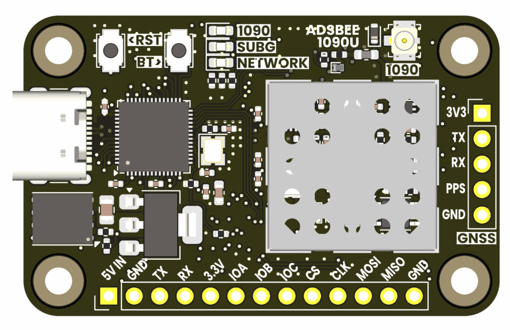
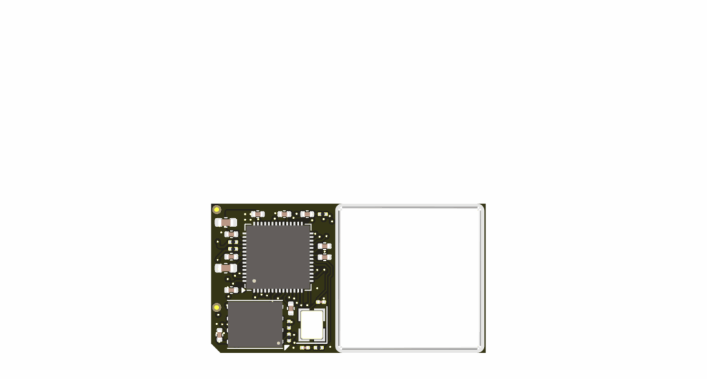
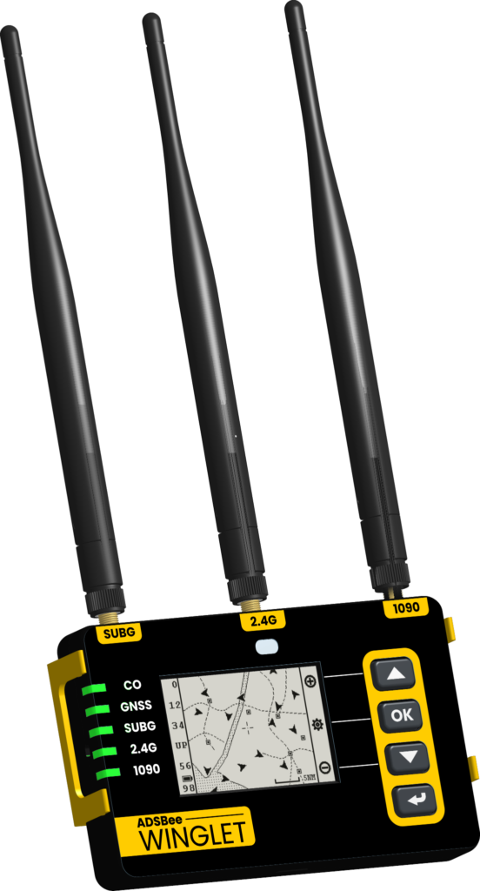
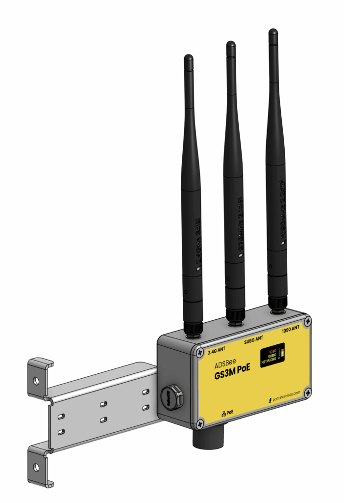

# ADSBee 1090 Family

Receivers in the ADSBee 1090 family are built around a discrete Mode S receiver architecture with a custom RP2040 PIO-based decoder. These devices offer full-featured ground station level performance comparable to SDR-based receivers for a fraction of the power and size.

All receivers currently offered in the ADSBee 1090 family are capable of dual band reception (Mode S + UAT, including traffic and weather), and many offer network capabilities (WiFi or Ethernet).

To get an ADSBee 1090 up and running, see the [Quick Start](../getting-started/quick-start.md).

## 1090U

Dual-band Mode S and UAT receiver with USB, UART, and WiFi connectivity options.

## m1090

Single-band solder-down receiver module for OEM applications.

Dual band RX / WiFi / Ethernet functionality available with additional components.

## Winglet

Tri-band Mode S, UAT, and 2.4GHz Remote ID receiver with USB, UART, WiFi, built-in battery, illuminated ePaper screen, membrane keypad, and sensors for electronic flight bag and high performance ground station applications. See the [ADSBee Winglet page](winglet.md).

{ width="300" }

## GS3M PoE

Dual-band Mode S and UAT industrial ground station with PoE.

{ width="300" }

## Datasheet

Datasheets are available on GitHub:

- [ADSBee 1090 datasheet](https://github.com/PantsForBirds/adsbee/blob/main/word/exports/datasheet_adsbee_1090.pdf)
- [ADSBee 1090 firmware reference guide](https://github.com/PantsForBirds/adsbee/blob/main/word/exports/firmware_reference_guide_adsbee_1090.pdf)
- [ADSBee m1090 eval board datasheet](https://github.com/PantsForBirds/adsbee/blob/main/word/exports/datasheet_adsbee_m1090_eval_board.pdf)
- [ADSBee GS3M PoE datasheet](https://github.com/PantsForBirds/adsbee/blob/main/word/exports/datasheet_gs3m_poe.pdf)

## Software

- [ADSBee 1090 web console](https://github.com/PantsForBirds/adsbee/blob/main/software/adsbee_1090_console/README.md)
- [Building the firmware](https://github.com/PantsForBirds/adsbee/blob/main/firmware/README.md)
