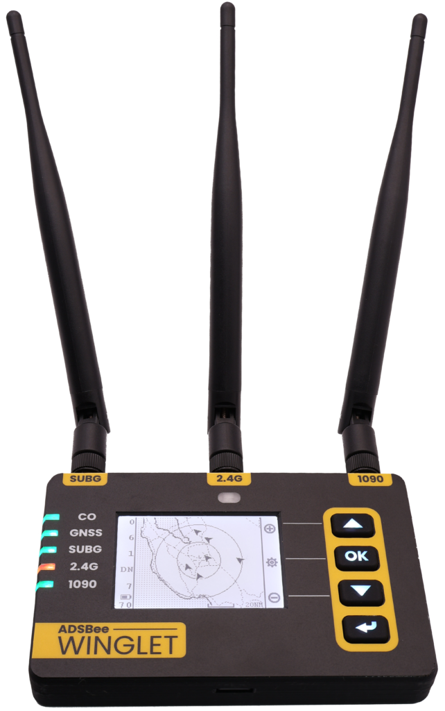
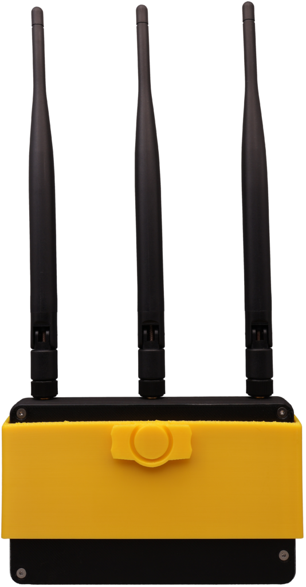

# ADSBee Winglet

{ width="320" }

**ADSBee Winglet** is a portable, battery-powered, tri-band air traffic receiver for general aviation and high performance portable applications. It receives **1090MHz Mode S / ADS-B**, **978MHz UAT** (traffic and weather), and **2.4GHz Remote ID** broadcasts from drones, and it has a front-lit ePaper screen, a backlit keypad, and a set of onboard sensors.

Winglet sits between an open source embedded receiver like the [ADSBee 1090U](index.md#1090u) and a full-featured electronic flight bag (EFB) receiver. Under the hood it builds on the proven ADSBee 1090U dual-band receiver architecture using the **ADSBee m1090** solder-down module, and it runs the same open source ADSBee firmware. Anything we build for Winglet (GNSS integration, sensor fusion, data logging, the on-device UI) can be ported into any project that runs the ADSBee codebase.

[Chat about Winglet on Discord](https://discord.gg/KRgVT9sSVW)

## Status

We launched Winglet on Kickstarter in July 2026, then moved it to a preorder system on our webstore in August. **Our expected ship date is mid to late November 2026.** We’ll post updates here and in our monthly [ADSBee updates](https://pantsforbirds.com/adsbee-update-august-2026/).

Winglets shipped to fulfill preorders are sold as developer kits: they don’t carry FCC Part 15 or UL battery certifications, but the functionality is unchanged. The only intentional emitter on Winglet is a pre-certified ESP32 WiFi module, and the battery pack is still built to UL standards by our battery manufacturer.

*Note: Winglet no longer includes the carbon monoxide (CO) sensor shown in our original announcement, in order to comply with an existing patent. Some renders and photos still show the earlier hardware and will be updated when the final hardware revision is done.*

## Quick Specs

| | |
| --- | --- |
| **Receive bands** | 1090MHz Mode S / ADS-B<br>978MHz UAT, including FIS-B / TIS-B uplink (maybe other sub-GHz protocols in the future)<br>2.4GHz Remote ID (Bluetooth and WiFi) |
| **Receiver core** | ADSBee m1090 module (RP2040 + 1090MHz RF frontend), sub-GHz radio, and an ESP32-S3 with additional PSRAM for networking and the UI |
| **Antennas** | 3x external (1090MHz, sub-GHz, 2.4GHz); switchable bias tees on the 1090MHz and sub-GHz inputs |
| **GNSS** | Multi-constellation WAAS GNSS receiver (u-blox MAX-M10), onboard helical antenna, auxiliary U.FL input |
| **Sensors** | IMU, magnetometer, pressure altitude, humidity |
| **Interface** | Front-lit ePaper screen<br>Backlit membrane keypad<br>5x color-changing status indicator LEDs<br>Web interface (mobile or desktop) |
| **Connectivity** | WiFi (join a network or host one), 13-pin ADSBee expansion header |
| **Battery** | Internal, user-replaceable, 12+ hrs battery life |
| **Charging** | USB-C, up to 5V 3A |
| **Mounting** | Removable snap-on holster with a Sentry-style RAM mount latch |
| **Source** | Open (ADSBee firmware is GPL v3; enclosure and holster are open source, 3D printed in PETG) |

## Hardware Features

### Full-featured UI

The center of Winglet’s front face is an ePaper screen that’s easy to read in all lighting conditions. In bright sunlight it looks just like a sheet of paper, and in the dark a gentle front-light turns on automatically to keep it legible (but not too bright). Status indicator lights show GNSS receiver health and the status of the three receive bands.

Instead of a single button (or no buttons at all), Winglet has a custom membrane keypad on the right side of its case. Each button has its own full color backlight and a soft tactile feel that works even with gloves on. The keypad drives a menu-driven interface on the ePaper screen for basic functions, like enabling / disabling WiFi, scrolling through sensor values, or viewing an onboard map (low-res map tiles are loaded from the onboard SD card). More complex configuration happens in the web interface.

### External antennas

Most EFB receivers use internal antennas, often printed directly onto lossy PCB substrate. That keeps them small and cheap, but costs a lot of receive range. Winglet uses the same external antennas as the ADSBee 1090U, so you get good range out of the box and can attach your own antennas or feed lines (e.g. cables running to antennas mounted above a metal wing).

The third antenna covers the 2.4GHz band used by drones broadcasting Remote ID over Bluetooth and WiFi. The same antenna is used to join external WiFi networks (for feeding data) or to host a local network for companion devices like iPads running ForeFlight. It has better gain than the internal WiFi antenna on the ADSBee 1090U, which helps both drone detection range and WiFi range.

Both the 1090MHz and sub-GHz antenna inputs have switchable bias tees (just like the 1090U) for powering external LNAs or other RF accessories through the antenna ports.

### Battery and power

Winglet has an internal rechargeable battery, a battery monitoring system that keeps learning the battery’s capacity over its lifetime, and USB-C fast charging at up to 5V 3A. Together that gives 12+ hours of battery life with precise estimates of the remaining capacity. We’re not big fans of planned obsolescence, so the battery is fully user replaceable with a screwdriver and about 5 minutes of time.

### GNSS and sensors

Winglet includes a multi-constellation WAAS GNSS receiver for precise position, plus an onboard magnetometer and IMU for heading and attitude. The IMU is intended to feed a backup attitude display (AHRS) on your tablet via GDL90. Pressure altitude and humidity sensors round out the sensor suite.

A surface mount helical GNSS antenna on the Winglet PCBA is enough for most applications. If you want to build your own GNSS antenna system, there is an auxiliary U.FL connector on the PCB: move one ceramic capacitor to reroute the antenna trace from the internal antenna to the U.FL. A solder jumper powers a bias tee on the auxiliary input, in case you want to run an external active GNSS antenna directly from Winglet.

### More memory, more aircraft

The ESP32-S3 module on Winglet, which runs the network interfaces and the UI, has additional PSRAM. That extra room lets us grow the aircraft dictionary (the number of aircraft tracked simultaneously) from 200 aircraft on the ADSBee 1090U to 400 aircraft on Winglet, and lets Remote ID reception run alongside WiFi.

### Mounting

Winglet uses a two-part mounting system. A removable holster snaps onto the back of the Winglet and can be quickly disconnected and reattached, so you can pull the receiver off for configuration or charging. The back of the holster has a latch that fits the standard Sentry-style RAM mount that’s already in thousands of cockpits and flight bags.

The enclosure and holster are open source and 3D printed out of PETG, so you can adapt them with your own design.

{ width="320" }

### Expansion header

For the turbo-nerds, Winglet has the same 13-pin expansion header as the ADSBee 1090U, so it’s compatible with the expansion “pants” designed for the 1090U. We designed Winglet’s power system so it can receive power and data over PoE using our [ADSBee PoE Pant](https://pantsforbirds.com/product/adsbee-1090-poe-pant/), which means a Winglet can be connected and charged via PoE in portable or fixed receiver setups. The header works with the battery still installed, and the PCB has surface-mount threaded standoffs so a pant can be mounted from the back of the board.

## Winglet vs. ADSBee 1090U

Winglet and the [ADSBee 1090U](index.md#1090u) share the same receiver architecture and firmware. The 1090U is a compact board for ground stations, feeders, and embedded projects. Winglet wraps the same receiver in a battery-powered handheld with a screen, sensors, and a third antenna.

|  | ADSBee 1090U | ADSBee Winglet |
| --- | --- | --- |
| Form factor | Single PCBA (enclosures available as accessories) | Handheld receiver with enclosure and snap-on holster |
| 1090MHz receiver | RP2040 + custom RF frontend on the main board | ADSBee m1090 module (RP2040 + RF frontend) |
| 978MHz UAT | Yes | Yes |
| 2.4GHz antenna | Internal (ESP32-S3 module) | External, used for WiFi and Remote ID |
| Aircraft dictionary | 200 aircraft | 400 aircraft (ESP32-S3 with additional PSRAM) |
| GNSS | Optional, via GNSS module connector | Built in (u-blox MAX-M10), helical antenna + auxiliary U.FL |
| Power | External power, ~1W | Internal replaceable battery (12+ hrs), USB-C charging |
| User interface | USB console, web interface | ePaper screen, backlit keypad, 5 status LEDs, web interface |
| Sensors | None | IMU, magnetometer, pressure altitude, humidity |
| Expansion | 13-pin expansion header | Same 13-pin expansion header (PoE Pant compatible) |

## Supported Protocols

Winglet runs ADSBee 1090 firmware, so it decodes and reports the same things as the rest of the ADSBee 1090 family:

- **Receive:** 1090MHz Mode S and ADS-B; 978MHz UAT ADS-B and ground uplink (FIS-B / TIS-B); 2.4GHz Remote ID over Bluetooth and WiFi (experimental).
- **Reporting protocols:** Raw packets, CSBee, MAVLINK1, MAVLINK2, GDL90 (with or without UAT uplink), Mode S Beast, and Aircraft JSON.
- **Network feeds:** stream decoded data to feeders and other endpoints over WiFi, with no external computer required.

GDL90 is the open data format used by EFB apps, so a tablet connected to Winglet’s WiFi network can display traffic and weather.

## Firmware and Getting Started

Winglet uses the same firmware image as the ADSBee 1090U: one `.uf2` file (`adsbee_1090-<version>.uf2`, or `combined.uf2` in older releases) that updates the RP2040, the ESP32-S3, and the sub-GHz radio together. The firmware recognizes Winglet by its part number and automatically sets up its built-in u-blox MAX-M10 GNSS receiver. Winglet support, GNSS support, and experimental Remote ID reception first appeared in the [ADSBee 1090 firmware 0.9.1 release candidates](https://github.com/PantsForBirds/adsbee/releases), and they’re under active development on the main branch.

Configuring and updating a Winglet works the same way as on the 1090U: use the web interface (which now has a full settings GUI) or the AT command console over USB, and update firmware by copying the release `.uf2` file over USB or with an OTA update through the web interface. The [Quick Start guide](../getting-started/quick-start.md) walks through all of it. A couple of useful commands:

```
AT+DEVICE_INFO?     # part code and firmware version
AT+GNSS_FIX?        # current GNSS fix
AT+REMOTE_ID=1      # enable Remote ID reception (experimental)
AT+SETTINGS?JSON    # dump all settings as JSON
AT+SETTINGS=SAVE    # save settings to nonvolatile memory
```

The Winglet-specific parts of the firmware (the ePaper UI and keypad menus, battery monitoring, onboard sensor readouts, and AHRS output over GDL90) are still in development. They’ll land in the open source ADSBee repository as they’re ready, and we’ll update this page when they do.

If you’d like to build the firmware yourself, follow the [firmware README](https://github.com/PantsForBirds/adsbee/blob/main/firmware/README.md) (`bash firmware/build.sh adsbee_1090` builds the RP2040, ESP32-S3, and CC1312 images into `combined.uf2`).

## Open Source Hardware + Software

Like the rest of ADSBee, Winglet’s firmware is released under a GNU GPL v3 license, and its enclosure and holster are open source. We hope Winglet will be useful in its own right, and also a launching point for other open source products built on the ADSBee m1090 module. For commercial licensing requests, please contact [john@pantsforbirds.com](mailto:john@pantsforbirds.com).

## Links

- [Announcing ADSBee Winglet!](https://pantsforbirds.com/announcing-adsbee-winglet/) (original announcement)
- [ADSBee Update August 2026](https://pantsforbirds.com/adsbee-update-august-2026/) (preorder and ship date update)
- [ADSBee 1090](index.md) and [Quick Start](../getting-started/quick-start.md)
- [ADSBee m1421 dual-band module](../adsbee-1421/m1421.md)
- [ADSBee on GitHub](https://github.com/PantsForBirds/adsbee) ([firmware releases](https://github.com/PantsForBirds/adsbee/releases))
- [Pants for Birds Discord](https://discord.gg/KRgVT9sSVW) (#winglet channel)