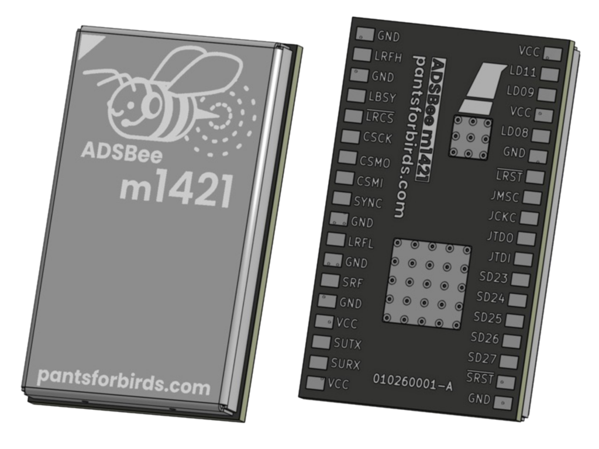

# ADSBee 1421 Family

Receivers in the ADSBee 1421 family are built around an integrated RF transceiver (Semtech LR2021) and low power RF MCU (TI CC1314). These devices offer the smallest form factor, lowest power draw, and lowest cost, with excellent receiver performance that is well suited to aircraft tracking applications.

All receivers offered in the ADSBee 1421 family are capable of dual band reception (Mode S + UAT, including traffic and weather), and are connected via UART.

## m1421

World’s smallest solder-down dual-band ADS-B receiver module. Tracks 400 aircraft with as much power as it takes to light an LED. See the [ADSBee m1421 page](m1421.md) for specs, pinout, and integration notes.

## 1421 Devkit

Everything you need to get started with an ADSBee m1421, in our minimum form factor dual-band reference design (ADSBee 1421). See [Developer Kit](m1421.md#developer-kit).

## Datasheet

Datasheets are available on GitHub:

- [ADSBee m1421 datasheet](https://github.com/PantsForBirds/adsbee/blob/main/word/exports/datasheet_adsbee_m1421.pdf)
- [ADSBee 1421 Developer Kit datasheet](https://github.com/PantsForBirds/adsbee/blob/main/word/exports/datasheet_adsbee_1421_devkit.pdf)

## Software

- [ADSBee 1421 / m1421 firmware](https://github.com/PantsForBirds/adsbee/blob/main/firmware/adsbee_1421/README.md), including reflashing over UART
- [ADSBee m1421 web console](https://github.com/PantsForBirds/adsbee/blob/main/software/adsbee_1421_console/README.md)
- [Building the firmware](https://github.com/PantsForBirds/adsbee/blob/main/firmware/README.md)
