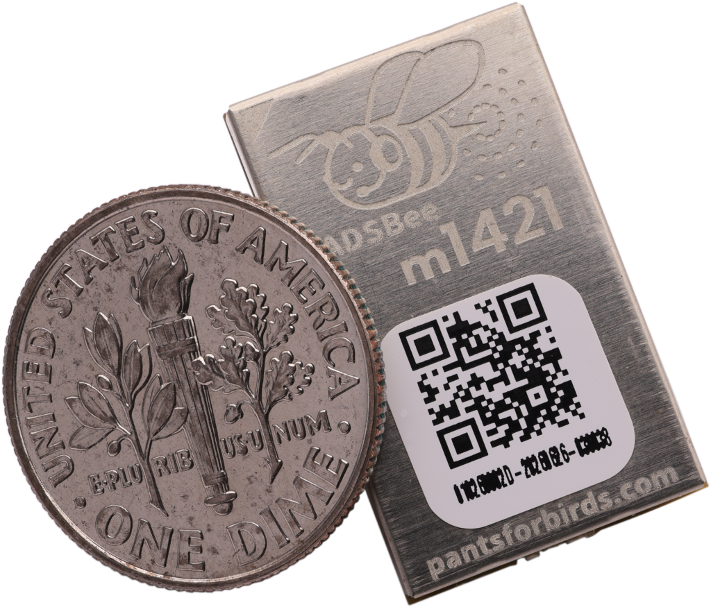
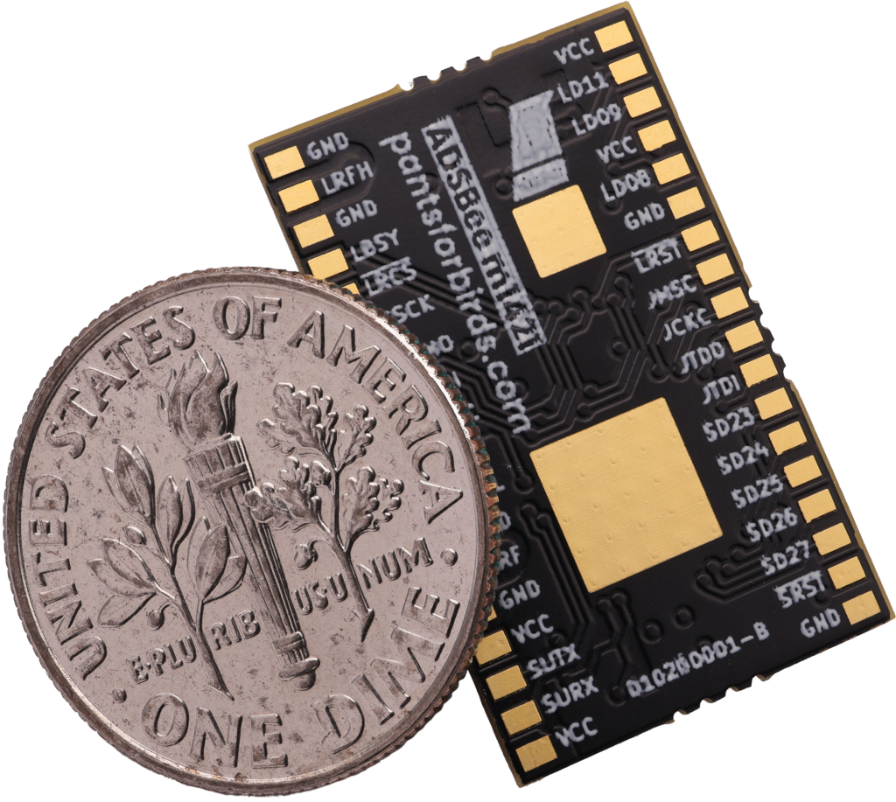
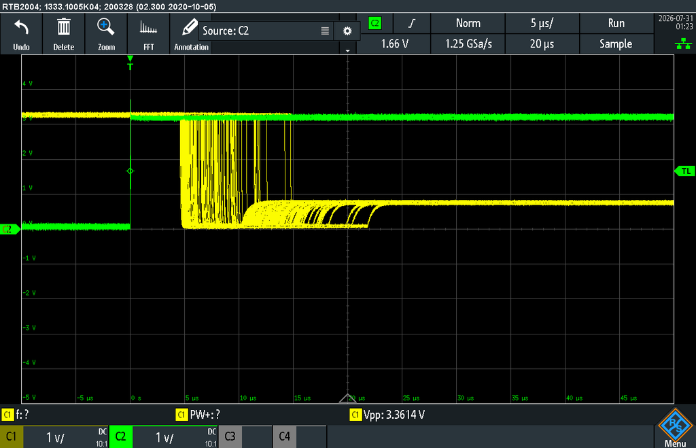
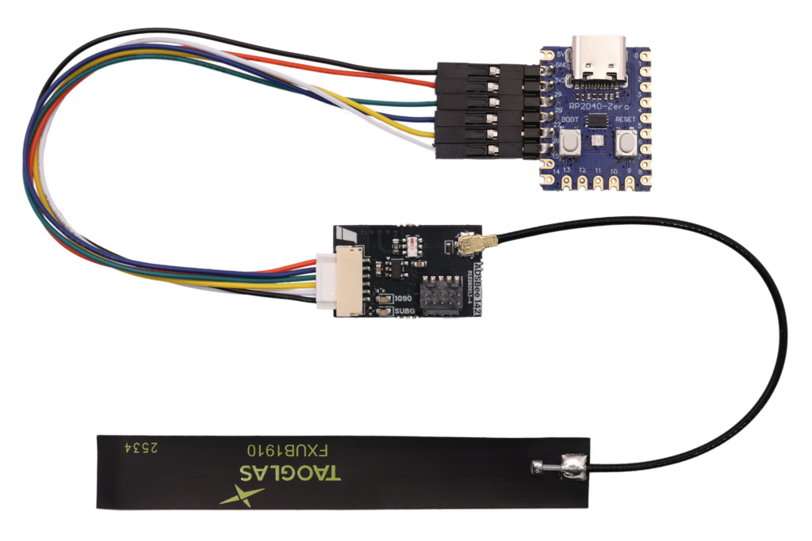
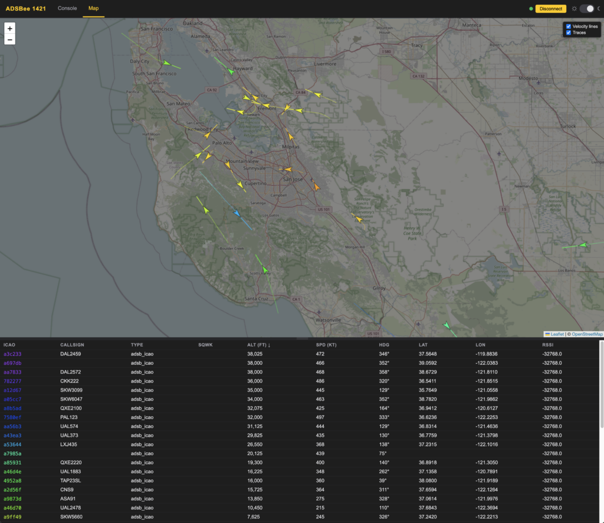

# ADSBee m1421 Dual-Band Module

{ width="480" }

**ADSBee m1421** is an ultra low power, ultra compact dual-band ADS-B receiver module. It receives **1090MHz Mode S / ADS-B** and **978MHz UAT** (including TIS-B traffic and FIS-B weather uplink), tracks up to 400 aircraft onboard, and reports them over a single UART. It’s built for mass and power constrained embedded applications like detect and avoid for drones.

The name comes from what’s under the hood: a TI **CC1314** low power RF MCU and a Semtech **LR2021** radio. The “m” means it’s a solder-down module, like the ADSBee m1090. The firmware and schematic are open source, and the aircraft decoding and tracking code is shared with our ADSBee 1090 firmware.

[Datasheet](https://github.com/PantsForBirds/adsbee/blob/main/word/exports/datasheet_adsbee_m1421.pdf)

## Overview

Semtech’s LR2021 includes a high bit rate OOK receiver and demodulator, which packs the Mode S RF chain we used to build out of discrete parts (like on the ADSBee 1090U) into a single chip, with far less size and power. The CC1314 is the next generation of the TI CC1312 that receives UAT on the ADSBee 1090U. On m1421, the LR2021 receives 1090MHz, the CC1314’s sub-GHz radio receives 978MHz UAT, and the CC1314’s Cortex-M33 does all of the demodulation, FEC, decoding, and aircraft tracking.

- 1090MHz Mode S / ADS-B and 978MHz UAT reception, including ADS-R, TIS-B, and FIS-B (including NOTAMs and weather).
- Onboard aircraft dictionary with up to 400 simultaneous aircraft.
- UART console with an AT command set for configuration; settings are saved to flash.
- Reporting protocols: Raw packets, CSBee, MAVLINK1, MAVLINK2, GDL90, Mode S Beast, and Aircraft JSON.
- SYNC line for host-controlled sleep, which also hands the LR2021 (and its 2.4GHz radio) over to an external MCU.
- Firmware updates over the UART ROM bootloader (no debugger needed) or JTAG.
- Available in standard and NDAA-compliant variants.

{ width="480" }

## Specs

| | |
| --- | --- |
| **Receive bands** | 1090MHz Mode S / ADS-B (LR2021)<br>978MHz UAT ADS-B + uplink (CC1314 sub-GHz radio) |
| **Processor** | TI CC1314R10 (Arm Cortex-M33) |
| **Supply voltage** | 1.8V – 3.3V |
| **Power draw** | 19mA @ 1.8-3.3V (less than 60mW) |
| **Minimum RF input power level** | Mode S: -90dBm<br>UAT: -87dBm |
| **Dynamic range** | Mode S: 90dB<br>UAT: 87dB |
| **Simultaneous aircraft tracks** | Up to 400 |
| **Host interface** | UART (console), 1,000,000 baud by default |
| **Output protocols** | Raw, CSBee, MAVLINK1, MAVLINK2, GDL90, Mode S Beast, Aircraft JSON |
| **Dimensions** | 23.4 x 14.5 x 2.7mm |
| **Weight** | 1.85g |
| **Package** | 36-pin solder-down module with two thermal pads |
| **Firmware updates** | UART ROM bootloader or JTAG |
| **License** | Firmware and schematic: GNU GPL v3 |

## ADSBee m1421 or ADSBee 1090?

ADSBee 1421 doesn’t replace the [ADSBee 1090](../adsbee-1090/index.md) family; they have very different architectures and are good at different things.

To get good dynamic range (receiving very close and very far away aircraft at the same time), the LR2021 is tuned by default to listen for only one Mode S packet type: Downlink Format 17, aka ADS-B. It’s great at seeing where planes are, but you won’t receive squawk codes, and you’ll receive fewer non-ADS-B packets. That’s usually fine for detect and avoid, but can be a drawback for data gathering. You can switch the receiver to the full Mode S preamble to receive all Mode S packet types, at the cost of dynamic range (close-in aircraft can have poor reception).

In its high-throughput configuration, the LR2021 also doesn’t provide per-packet timestamps or RSSI, so m1421 doesn’t support multilateration (MLAT) out of the box.

| Choose… | If you need… |
| --- | --- |
| [ADSBee 1090](../adsbee-1090/index.md) | Full-featured dual-band ADS-B with all the bells and whistles, where power / form factor / cost are secondary. Built-in WiFi / Ethernet / USB connectivity, MLAT timestamps, per-packet RSSI, and all Mode S packet types. |
| ADSBee m1421 | Dual-band ADS-B for aircraft tracking where power / form factor / cost are very important. UART interface only. |

## Pinout

ADSBee m1421 has 36 pins plus two thermal pads (MP) under the CC1314 and LR2021. Pins marked \* are only needed for direct control of the LR2021; leave them unconnected for normal applications.

| Pin | Name | Function | Pin | Name | Function |
| --- | --- | --- | --- | --- | --- |
| 1 | VCC | Power supply (1.8V – 3.3V) | 19 | VCC | Power supply (1.8V – 3.3V) |
| 2 | LD11\* | LR2021 DIO11 | 20 | SURX | CC1314 UART RX (console input) |
| 3 | LD09\* | LR2021 DIO9 | 21 | SUTX | CC1314 UART TX (console output) |
| 4 | VCC | Power supply (1.8V – 3.3V) | 22 | VCC | Power supply (1.8V – 3.3V) |
| 5 | LD08\* | LR2021 DIO8 | 23 | GND | Ground |
| 6 | GND | Ground | 24 | SRF | Sub-GHz (978MHz UAT) RF, 50 Ohm |
| 7 | ~LRST\* | LR2021 reset (active low) | 25 | GND | Ground |
| 8 | JMSC | CC1314 JTAG TMSC | 26 | LRFL | Mode S (1090MHz) RF, 50 Ohm |
| 9 | JCKC | CC1314 JTAG TCKC | 27 | GND | Ground |
| 10 | JTDO | CC1314 JTAG TDO | 28 | SYNC | Drive high to suspend the CC1314 (also the bootloader trigger) |
| 11 | JTDI | CC1314 JTAG TDI | 29 | CSMI\* | LR2021 SPI MISO |
| 12 | SD23 | CC1314 DIO23 | 30 | CSMO\* | LR2021 SPI MOSI |
| 13 | SD24 | CC1314 DIO24 | 31 | CSCK\* | LR2021 SPI SCK |
| 14 | SD25 | CC1314 DIO25 | 32 | ~LRCS\* | LR2021 SPI CS |
| 15 | SD26 | CC1314 DIO26 (1090MHz activity LED output) | 33 | LBSY\* | LR2021 busy |
| 16 | SD27 | CC1314 DIO27 (sub-GHz activity LED output) | 34 | GND | Ground |
| 17 | ~SRST | CC1314 reset (active low) | 35 | LRFH\* | LR2021 2.4GHz RF, 50 Ohm |
| 18 | GND | Ground | 36 | GND | Ground |
| MP |  | Thermal pads for CC1314 and LR2021 (connect to ground) |  |  |  |

Module dimensions and the recommended footprint are in the [datasheet](https://github.com/PantsForBirds/adsbee/blob/main/word/exports/datasheet_adsbee_m1421.pdf). The schematic is in the repo at [kicad/adsbee\_m1421](https://github.com/PantsForBirds/adsbee/tree/main/kicad/adsbee_m1421).

## Designing m1421 Into Your Hardware

Quite a few customers have already put ADSBee m1421 onto their own carrier boards. Our KiCad [footprint](https://github.com/PantsForBirds/kicad-libs/blob/main/lib_fp/Custom_Module.pretty/PantsForBirds_ADSBee_m1421_Module.kicad_mod), symbols, and 3D models are freely available, and the design files for our [ADSBee 1421 minimum form factor carrier board](https://pantsforbirds.com/wp-content/uploads/2026/06/adsbee_1421-A.zip) make a good reference design.

### Minimum connections

For normal use as an ADS-B receiver you only need power, ground, the RF inputs, and a handful of signals to your host. These match the 6-pin comms connector on the ADSBee 1421 carrier board:

- **VCC** (all four VCC pins) at 1.8V – 3.3V, and **GND**. Logic levels are 0 – VCC.
- **SURX / SUTX**: the console UART. This carries AT commands, the selected reporting protocol, and log messages.
- **~SRST** and **SYNC**: we strongly recommend routing both to host GPIOs. Together they let your host put the module to sleep and update its firmware in the field (see below). SYNC has a weak pull-down, so a floating SYNC keeps the module awake.
- **LRFL** (1090MHz) and **SRF** (978MHz) to your antenna(s). The ADSBee 1421 carrier board uses a power combiner so a single dual-band antenna feeds both inputs.

### RF and layout

- LRFH, LRFL, and SRF are 50 Ohm coplanar waveguides on the module. Break them out as microstrip or coplanar waveguide, whichever you prefer.
- Respect the top copper keepouts in the footprint, where impedance controlled transmission lines run on the surface of the module.
- Filled and capped vias directly under the GND pads next to the RF pins are recommended for minimal impedance discontinuity.
- Connect both MP thermal pads to a ground plane with filled and capped thermal vias.
- All exposed copper pads should have paste.

### Assembly

For production, ADSBee m1421 ships in trays of 50, so any contract manufacturer can place it on your PCB. The serial number label on every module is reflow safe and chemical resistant, and the module can withstand up to two reflow passes, so you can put it on the top or bottom of your board without any special precautions.

### Console and reporting

The console UART runs at 1,000,000 baud by default. You can change it to any rate from 9600 to 3,000,000 baud with `AT+BAUD_RATE=CONSOLE,<baud>` and save it with `AT+SETTINGS=SAVE`; we recommend 921600 or above, since verbose reporting protocols can bottleneck at 115200. The console sends `UU` at its current rate after every rate change, at boot, and on a UART break, so a host can detect the rate. If the console is also your reporting interface, silence the debug logs so they don’t get mixed into your data:

```
AT+LOG_LEVEL=SILENT
AT+PROTOCOL_OUT=CONSOLE,MAVLINK2
AT+MAVLINK_ID=1,156
AT+SETTINGS=SAVE
```

Once configured, you can plug m1421 into anything that accepts ADS-B data over UART, like a drone flight controller or your own host MCU. A few other commands you’ll likely use:

| Command | What it does |
| --- | --- |
| `AT+DEVICE_INFO?` | Part code, unique ID, and firmware version. |
| `AT+PROTOCOL_OUT=CONSOLE,<protocol>` | NONE, RAW, BEAST, BEAST\_NO\_UAT, BEAST\_NO\_UAT\_UPLINK, CSBEE, MAVLINK1, MAVLINK2, GDL90, GDL90\_NO\_UAT\_UPLINK, AIRCRAFT\_JSON. |
| `AT+R1090_PREAMBLE=<mode>` | DF17 (default, DF17 frames only), MODE\_S (every downlink format, weak to about -40 dBm), MODE\_S\_STRONG (about -45 to 0 dBm), or MODE\_S\_SMART (MODE\_S with short MODE\_S\_STRONG slices, more STRONG time while strong aircraft are around). |
| `AT+R1090_GAIN=<step>` | 1090MHz front-end gain: AUTO (default) or a manual step. |
| `AT+SUBG_MODE=<mode>` | UAT\_RX (default) or UAT\_RX\_NO\_UPLINK to skip FIS-B / TIS-B uplink and save airtime and CPU. |
| `AT+RX_ENABLE=<all>,<1090>,<subg>` | Enable or disable each receiver. |
| `AT+RX_POSITION=...` | Set the receiver position (FIXED, GNSS, LOWEST, ICAO, or NONE), used for things like distance to aircraft. |
| `AT+RX_STATS?` | Receiver packet and health counters. |
| `AT+WATCHDOG=<seconds>` | Watchdog timeout (10 seconds by default, 0 disables). |
| `AT+SETTINGS=SAVE` | Save settings to flash (also LOAD, RESET). |

The full AT command and reporting protocol reference is in the [ADSBee m1421 datasheet](https://github.com/PantsForBirds/adsbee/blob/main/word/exports/datasheet_adsbee_m1421.pdf).

### Firmware updates from your host { #firmware-updates-from-your-host }

Holding SYNC high on the rising edge of ~SRST puts the CC1314 into its ROM UART bootloader on the SURX / SUTX pins, so your host can reflash m1421 over the same UART it already uses. The ADSBee 1421 Programmer (an RP2040 Zero) does exactly this: it checks the module’s firmware against the image baked into its own flash, updates it if needed, and then acts as a USB to serial bridge. Its [firmware is open source](https://github.com/PantsForBirds/adsbee/tree/main/firmware/adsbee_1421/programmer), so you can remix it to give your own host MCU automatic firmware updates. The [ADSBee 1421 firmware README](https://github.com/PantsForBirds/adsbee/blob/main/firmware/adsbee_1421/README.md) describes the bootloader entry sequence in detail. JTAG (pins 8-11) is also available for flashing and breakpoint debugging with a J-Link or equivalent cJTAG probe.

### SYNC sleep and LR2021 handoff

The LR2021 is a capable radio beyond Mode S. Its 2.4GHz frontend is broken out on the LRFH pin, so you can reuse it as a mesh radio with LoRa and other supported protocols. Driving SYNC high puts the CC1314 into a low power sleep state and releases all of the LR2021 control lines so an external MCU can take over. The CC1314 retains its aircraft data while asleep, so you can time-share between mesh radio and Mode S reception.



*The LR2021 RESET line (yellow) being released by m1421 after SYNC (green) goes high, persisted across hundreds of handovers.*

- To take over the LR2021: drive SYNC high, then wait until ~LRST is released or 40us have passed, whichever comes first. In our testing m1421 is clear of the bus in around 25us.
- To give it back: stop driving the LR2021 bus first, then drive SYNC low. The CC1314 wakes up, takes the bus back, and re-initializes its receivers.
- Firmware 0.3.11-rc1 adds `AT+LR_ENABLE=0`, which releases the LR2021 bus to an external host without putting the CC1314 to sleep. 1090MHz reception stops while the bus is released; `AT+LR_ENABLE=1` hands it back.
- If m1421 will sleep longer than the watchdog interval (10 seconds by default), disable the watchdog with `AT+WATCHDOG=0`. Otherwise the watchdog resets the module during sleep, and with SYNC still high it will enter the bootloader.

ADSBee m1421 does not currently carry any module-level certification as a transmitter, so it must only be used as a transmitter in compliance with local regulations. If you’re planning to use the LR2021 this way, get in touch and we’ll help.

## Developer Kit { #developer-kit }

The easiest way to get started is the ADSBee 1421 Developer Kit. It includes an ADSBee m1421 soldered to our open source minimum form factor carrier board (that combination is what we call the ADSBee 1421) with a 10-pin ARM SWD header for breakpoint debugging, a dual-band 1090 / 978MHz flex antenna, a JST-GH to DuPont wire harness, and the ADSBee 1421 Programmer. See the [Developer Kit datasheet](https://github.com/PantsForBirds/adsbee/blob/main/word/exports/datasheet_adsbee_1421_devkit.pdf) for pinouts and wiring.



## Firmware and Software

ADSBee m1421 firmware lives in the main [ADSBee repository](https://github.com/PantsForBirds/adsbee) under `firmware/adsbee_1421/`, and shares its Mode S / UAT decoders and aircraft dictionary with ADSBee 1090. Releases are tagged `adsbee_1421-<version>` on the [releases page](https://github.com/PantsForBirds/adsbee/releases). Each release includes the firmware `.hex` and an `adsbee_1421_programmer-fw<version>.uf2` image for the ADSBee 1421 Programmer. Use `AT+DEVICE_INFO?` to see which version your module is running.

The [ADSBee 1421 web console](https://adsbee.aero/console/1421/adsbee_1421_console.html) on adsbee.aero connects to an ADSBee 1421 over Web Serial (Chrome or Edge). It gives you an AT command terminal, a settings GUI, firmware upload, and a live map of the aircraft you’re receiving. It’s a single HTML file, so you can download it and use it offline. Its source and feature list are in the [console README](https://github.com/PantsForBirds/adsbee/blob/main/software/adsbee_1421_console/README.md).



To build the firmware yourself (everything runs in Docker, so you only need Docker and git), follow the [firmware README](https://github.com/PantsForBirds/adsbee/blob/main/firmware/README.md); `bash firmware/build.sh adsbee_1421` produces `adsbee_1421-<version>.hex`.

## Open Source Hardware + Software

ADSBee m1421’s firmware and schematic are released under a GNU GPL v3 license. For very high volume applications (above 1k pieces per purchase, or more than 12k pieces per year) or commercial licensing requests, please contact [john@pantsforbirds.com](mailto:john@pantsforbirds.com).

## Links

- [ADSBee m1421 datasheet](https://github.com/PantsForBirds/adsbee/blob/main/word/exports/datasheet_adsbee_m1421.pdf) and [schematic](https://github.com/PantsForBirds/adsbee/tree/main/kicad/adsbee_m1421)
- [The World’s Smallest Dual-Band ADS-B Receiver Module](https://pantsforbirds.com/the-worlds-smallest-dual-band-ads-b-receiver-module/) (announcement)
- [ADSBee 1421 web console](https://adsbee.aero/console/1421/adsbee_1421_console.html)
- [ADSBee 1090](../adsbee-1090/index.md), [Quick Start](../getting-started/quick-start.md), and [ADSBee Winglet](../adsbee-1090/winglet.md)
- [Pants for Birds Discord](https://discord.gg/KRgVT9sSVW)