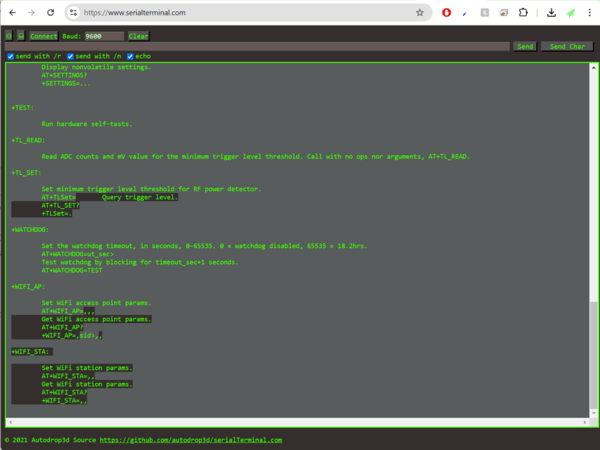
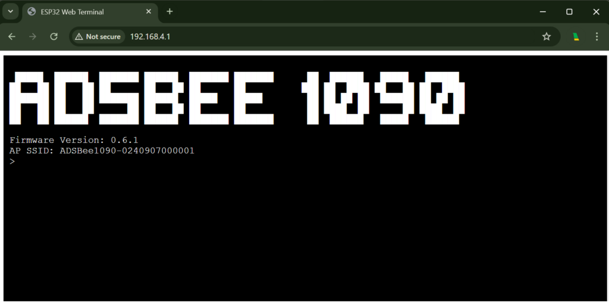
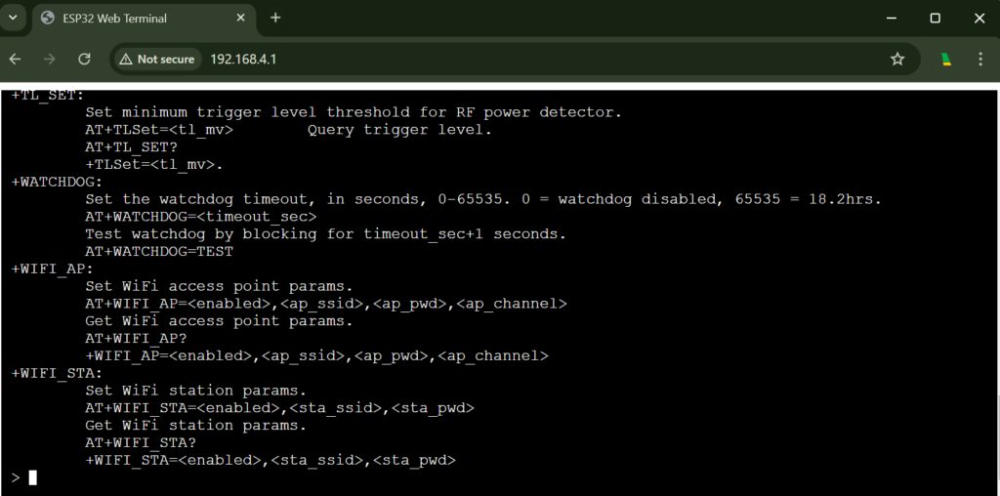
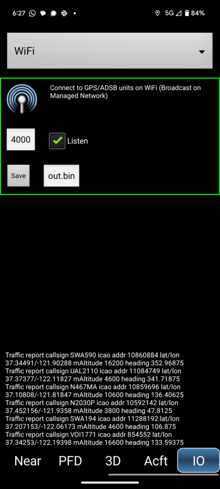
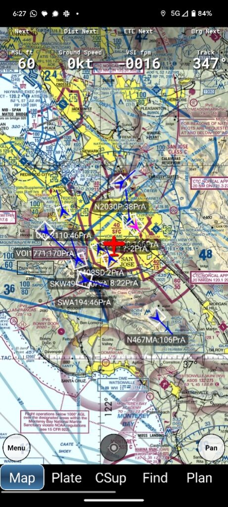
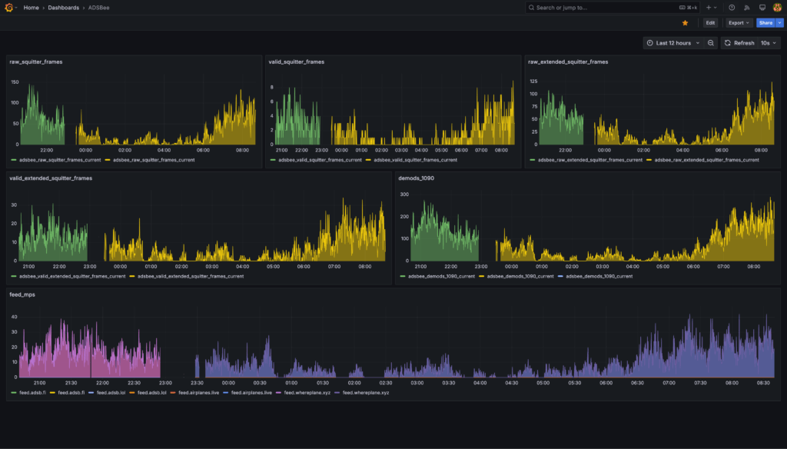

# Quick Start

Thanks for your purchase of an ADSBee 1090! This quick-start guide should get you headed in the right direction. Please select what you’d like to do from the options below to jump to more detailed instructions.

!!! note

    This quick start guide is a work in progress! Please let me know if you find any typos or want additional information by posting in the [#documentation](https://discord.gg/KRgVT9sSVW) channel on Discord!

## I’d like to…

### 🔧 Change Device Software or Hardware

[⬆️ Update the Firmware on my ADSBee](../guides/update-firmware.md)

[🥡 Modify the Enclosure of my ADSBee](../guides/modify-enclosure.md)

### 💾 Change Device Settings

[⌨️ Connect to the CLI](#connect-to-cli)

[📲 Feed air traffic data to an App](#feed-app)

[🌐 Feed raw packets to an Aggregator or Local Endpoint](#feed-aggregator)

[💡 Integrate ADSBee with an Embedded Project](#embedded-project)

[🛜 Join an External WiFi Network](#join-external-wifi)

[🛩️ Connect ADSBee to a Flight Controller](#connect-adsbee-flight-controller)

### 🔩 Get into the Nuts and Bolts

[📄 Read the ADSBee Datasheet](#adsbee-datasheet)

[🐝 Follow the ADSBee Project on GitHub](https://github.com/PantsForBirds/adsbee)

[📈 Export Metrics Data](#export-metrics)

## 📄 ADSBee Datasheet { #adsbee-datasheet }

Available for download from the [GitHub repo](https://github.com/PantsForBirds/adsbee/blob/main/word/exports/datasheet_adsbee_1090.pdf).

## ⌨️ Connect to the CLI { #connect-to-cli }

The ADSBee 1090’s settings can be changed via its Command Line Interface (CLI). The CLI can be accessed via USB or via a webpage serial terminal. For a full list of CLI commands, run `AT+HELP` in the CLI. A detailed description of the CLI commands and their functions can also be found in the ADSBee 1090 datasheet.

### Method 1: Connect via USB Serial Terminal

1. Connect the ADSBee 1090 to your computer via a USB C cable. The ADSBee 1090 should enumerate as a virtual COM port on Windows (or /dev/tty/whatever on Mac / Linux).
2. Connect to the ADSBee 1090’s COM port using your favorite serial terminal. NOTE: Baud rates and parity don’t matter, since this is a virtual COM port, but line endings MUST be set to `\r\n`, or else your commands may not be interpreted correctly or at all!
3. Type `AT+HELP` into the web terminal, and hit enter. This should provide a list of available AT commands as shown below. Use the AT commands to interact with the CLI as you please! Note that all changed settings will be discarded on reboot unless they are saved with `AT+SETTINGS=SAVE`. If you would like to revert to the default settings, use `AT+SETTINGS=RESET`.



#### Recommended Terminal Software

- Android: [Serial USB Terminal](https://play.google.com/store/apps/details?id=de.kai_morich.serial_usb_terminal&pcampaignid=web_share) by Kai Morich
- Desktop Windows / Mac / Linux: [Serialterminal.com](https://www.serialterminal.com/) in Chrome

### Method 2: Connect via ADSBee’s Webpage Serial Terminal

!!! warning

    Connecting to the web CLI is best done on a desktop computer in the Chrome browser. Some phones can connect to the web CLI, but there is a bug in some mobile browsers that currently causes text to be entered into the terminal in reverse.

1. Join the WiFi network generated by the ADSBee 1090 (SSID takes the form “ADSBee1090-0240907000001” or similar). The default password is `yummyflowers`.
2. In a web browser (tested and working on Chrome), visit the following web address: <http://192.168.4.1>. Note that there is no leading “www.”, and the protocol is HTTP, not HTTPS! You should arrive at the screen shown below. The web terminal will timeout after 10 minutes of inactivity, and can be revived by refreshing the page.

    

3. Type `AT+HELP` into the web terminal, and hit enter. This should provide a list of available AT commands as shown below. Use the AT commands to interact with the CLI as you please! Note that all changed settings will be discarded on reboot unless they are saved with `AT+SETTINGS=SAVE`. If you would like to revert to the default settings, use `AT+SETTINGS=RESET`.

!!! warning

    There are no guardrails on the CLI commands! You can turn off WiFi from the Web CLI, which will predictably stop you from being able to interact using said Web CLI. To recover, connect to the CLI via USB and run `AT+SETTINGS=RESET`.



!!! note

    The Web CLI can also be reached by visiting the ADSBee 1090’s IP address once it has joined an external WiFi network (e.g. the network created by the WiFi access point at your house). For instance, if your ADSBee 1090 was assigned an IP address of 10.3.2.5, then you could visit the web CLI by navigating to http://10.3.2.5 (note this is just an example). To get the IP address of the ADSBee 1090, visit the DHCP leases page on your router to see what IP has been assigned to the device.

### CLI Tips

- AT command arguments can be skipped by leaving them blank, and AT commands can be given fewer than their maximum number of arguments! For instance, if you just want to disable feed 5, you could send `AT+FEED=5,,,0,` instead of the more verbose `AT+FEED=5,78.46.234.18,30004,0,BEAST`. In the shorter command, the feed IP address, port, and protocol were omitted. Note that the trailing comma was not necessary, since the final argument is automatically passed as a blank field if it is missing. `AT+FEED=5,,,0` works just as well!
- Sending messages via the Web CLI can be time-intensive, and may cause the ESP32 to miss transponder packets if console verbosity is set too high. If you’d like to investigate packet reception and other info with `AT+LOG_LEVEL=INFO`, it’s recommended to do this via the USB terminal and keep the Web CLI interface closed. When using the web CLI, it is recommended to keep the Web CLI verbosity level at `AT+LOG_LEVEL=WARNINGS`, `AT+LOG_LEVEL=ERRORS`, or `AT+LOG_LEVEL=SILENT`.
- The console on the Web CLI will automatically time out after 10 minutes of inactivity (it can be re-activated with a page refresh).

### Method 3: Connect via WebSocket { #cli-connect-via-websocket }

If you want an SSH-style experience without using a browser, you can use a tool like [websocat](https://github.com/vi/websocat) to connect to the CLI of your ADSBee directly at `ws://<adsbee_ip_address>/console`.

For instance, to connect to an ADSBee with the hostname “window-bee3”, you could run the following command. Note that the `--binary` flag is used so that the ADSBee’s newlines come through correctly and everything gets indented properly.

```
websocat --binary ws://window-bee3.local/console
```

## 📲 Feed air traffic data to an App { #feed-app }

!!! note

    Electronic Flight Bag (EFB) devices are Android / iOS tablets loaded with maps / VFR charts / approach plates / etc for use by pilots. Devices like Stratux, Foreflight Sentry, and ADSBee 1090 can be used to feed EFB devices with aircraft traffic information over WiFi.

Here are a few apps that can be used with ADSBee 1090. If you have one that you like, please send me a note on Discord so that we can add it to the table!

| Platform / Use Case | iPhone | Android | Desktop |
| --- | --- | --- | --- |
| **Electronic Flight Bag** | [ForeFlight (paid)](https://apps.apple.com/us/app/foreflight-mobile-efb/id333252638) | [Avare (free)](https://play.google.com/store/apps/details?id=com.ds.avare&pcampaignid=web_share) |  |
| **Airplane Spotting** | [AeroADSB](https://apps.apple.com/us/app/aeroadsb/id1560168705) |  |  |

!!! warning

    ADSBee 1090 is still in Beta, and is not advised for use as a primary EFB traffic information device at this time. Feedback and testing is always welcome, but **safety is #1**! If you do fly with an ADSBee 1090, please make sure to use a tested and functional alternative device as your primary source for traffic information.

1. The ADSBee 1090 should be ready to go out-of-the-box for feeding most Electronic Flight Bag (EFB) devices! Power on your ADSBee 1090, and look for a WiFi network titled “ADSBee1090-0240907000001” or something similar (the number varies, as each ADSBee generates a WiFi network with its own unique SSID).
2. Join the WiFi network with your EFB device. The default password is `yummyflowers`. You will receive a notice that internet is not available, but your device should remain connected. Note that your device will be assigned an IP address on the subnet 192.168.4.X. The ADSBee is the gateway for this network, with an IP address of 192.168.4.1.
3. Configure your electronic flight bag app to accept GDL90 traffic information on port 4000 over UDP (this is the default for most apps). You should see aircraft data streaming into the app! Some example screenshots for Avare (a free Android EFB app) are shown below.

!!! note

    ADSBee 1090 doesn’t yet support ownship position reports, but it’s on the TODO list (need to integrate a GPS module, the hardware interface is already on the PCB). For now, ADSBee 1090 works best with devices that have their own GPS which can provide ownship position data.

{ width="300" }

*Note that the “IO” tab with this setting is reached by swiping left along the bottom of the screen. A bit tricky to find it by default!*

{ width="300" }

*Ownship position (red), and traffic (blue).*

## 🌐 Feed an Aggregator { #feed-aggregator }

!!! note

    ADSBee 1090 can stream the transponder packets it receives to an endpoint on a local WiFi network or on the public internet. This can be used to feed aggregators like airplanes.live, adsbexchange, or a local instance of tar1090 (a popular ADS-B decoding software package).

1. Access the Command Line Interface (CLI). There are multiple ways to do this, refer to the [Connecting to the CLI](#connect-to-cli) section to pick your favorite!
2. Configure the ADSBee 1090 to [join an external WiFi network](#join-external-wifi).
3. Check the current feed settings with `AT+FEED?`
4. Enter the details for your new feed with `AT+FEED=<feed_index>,<feed_uri>,<feed_port>,<feed_active>,<protocol>`.
   - `<feed_index>`: ADSBee can support up to 6 feeds simultaneously. This parameter is replaced with a digit from 0-5 in order to indicate which feed is being altered.
   - `<feed_uri>`: This parameter is replaced with the hostname, IPv4 address or IPv6 address (e.g. `2001:db8::5`) of the feed endpoint.
   - `<feed_port>`: This parameter indicates which port on the endpoint will be used for the feed. The most common value is 30004, the typical port for Mode-S Beast data over TCP.
   - `<active>`: Enable / disable the feed. Set this to 1 to activate the feed.
   - `<protocol>`: What protocol to use when feeding. Currently, only `BEAST` and `BEAST_RAW` are supported.
     - `BEAST` = All received transponder packets with a valid checksum.
     - `BEAST_RAW` = All received transponder packets, regardless of whether they had a valid checksum.
5. Check that your values were set correctly with `AT+FEED?`. You should see a sparkline graph below the terminal indicating a non-zero number of packets per second being forwarded to your feed (assuming your ADSBee is receiving packets).

Want to check the status of your feed? Use the links below to see your feed status for various aggregators. Note that values other than aircraft location, e.g. RSSI, are often shown for aircraft that are aggregated across all feeders, and may not reflect what your ADSBee is receiving.

- Airplanes.live
  - <https://airplanes.live/myfeed/>
- ADSB.fi
  - Click the status icon in the bottom left of the homepage: <https://adsb.fi/>
- ADSB.lol
  - <https://api.adsb.lol/0/me>

## 🛜 Join an External WiFi Network { #join-external-wifi }

1. [Connect to the CLI](#connect-to-cli) via the method of you choosing.
2. Run the command `AT+WIFI_STA?` to check your current WiFi station settings.
3. Enter the network credentials for your WiFi network with `AT+WIFI_STA=<enabled>,<ssid>,<password>`. In this case, replace `<enabled>` with `1`, `<ssid>` with the SSID of your network, and `<password>` with your WPA passkey (8-63 characters). Note that values should be comma separated, with no spaces in between! No quotes are required around any values.
4. Save the settings with `AT+SETTINGS=SAVE`. If you’d like, you can verify that they were saved by calling `AT+SETTINGS?`.
5. Apply the new WiFi settings by restarting the device with `AT+REBOOT`.

## 🌍 Use IPv6 { #ipv6 }

Ethernet and the WiFi station use IPv4 and IPv6 at the same time by default. IPv6 addresses come from link-local and stateless autoconfiguration (SLAAC) from your router; DNS servers come from DHCP or from router advertisements (RDNSS). DHCPv6 and static addresses aren't supported.

1. Check the addresses with `AT+NETWORK_INFO?`. The web interface is reachable at `http://[<IPv6 address>]/`, and as `<hostname>.local` over mDNS.
2. Select the IP versions with `AT+IP_MODE=<mode>`: `DUAL` (default), `IPV4` (IPv4 only) or `IPV6` (IPv6 only, DHCP off). The WiFi access point is always IPv4.
3. Apply with `AT+SETTINGS=SAVE`; the network interfaces restart.

## 💡 Integrate the ADSBee with an Embedded Project { #embedded-project }

The ADSBee 1090 is intended to interface easily with external modules via UART! Both the USB connector (CONSOLE) and UART output can be used to report received aircraft data in a variety of formats, including MAVLINK1, MAVLINK2, GDL90, Mode S Beast, and CSBEE. Of these protocols, CSBEE is the easiest to decode from scratch, and is also the most information rich.

### Connect a Device via UART

1. Connect to the [CLI](#connect-to-cli).
2. Configure the baudrate of the COMMS UART to your desired value using the `AT+BAUD_RATE` command. For instance, to set the baudrate to 115200 baud on the COMMS UART, send the command: `AT+BAUD_RATE=COMMS_UART,115200`. Verify your setting with `AT+BAUD_RATE?`.
3. Enable a reporting protocol on the COMMS UART. For instance, to enable CSBEE reporting, send `AT+PROTOCOL_OUT=COMMS_UART,CSBEE`. Verify your setting by checking the output of `AT+PROTOCOL_OUT?`.
4. Connect your external device to the pins on the ADSBee 1090 labeled GND, TX, and RX. Don’t forget to cross over TX and RX as necessary!
5. Save your settings with `AT+SETTINGS=SAVE`.

### Connect a Device via USB

1. Connect to the [CLI](#connect-to-cli).
2. Silence all log messages on the CONSOLE output, as this may mangle any protocol it’s attempting to transmit: `AT+LOG_LEVEL=SILENT`.
3. Set the desired reporting protocol on the CONSOLE output. For instance, to report CSBEE over the CONSOLE connection, send `AT+PROTOCOL_OUT=CONSOLE,CSBEE`.
4. Confirm that the protocol is being correctly output via the console. You will be able to see the protocol on both the serial and web CLI.
5. Save your settings with `AT+SETTINGS=SAVE`. You can now connect your ADSBee to another project and read data over USB with a library like PySerial!

## 🛩️ Connect ADSBee to a Flight Controller { #connect-adsbee-flight-controller }

ADSBee’s MAVLINK1 and MAVLINK2 output is supported by flight controllers running the iNAV firmware (and should work just fine with any flight controller that speaks MAVLINK).

Chris Corbett made a great video about getting started with ADSBee and an iNAV flight controller, check it out below!

[](https://www.youtube.com/watch?v=oQWU1zwIQLM)

## 📈 Export Metrics Data from ADSBee { #export-metrics }



Thanks to one of our community contributors, it’s possible to export live metrics from an ADSBee to Prometheus, a popular time series database application. Please see setup instructions on the Docker Hub link below for more information.

- [adsbee-metrics-exporter GitHub](https://github.com/BIGjuevos/adsbee-metrics-exporter/)
- [adsbee-metrics-exporter Docker Hub](https://hub.docker.com/r/bigjuevos/adsbee-metrics-exporter)