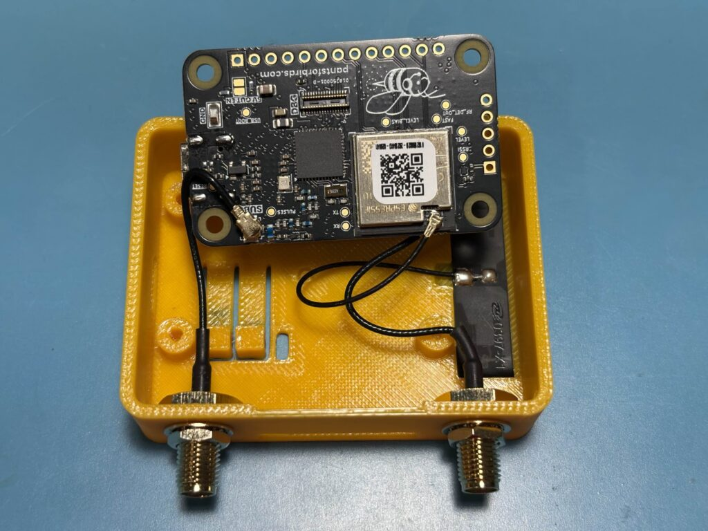
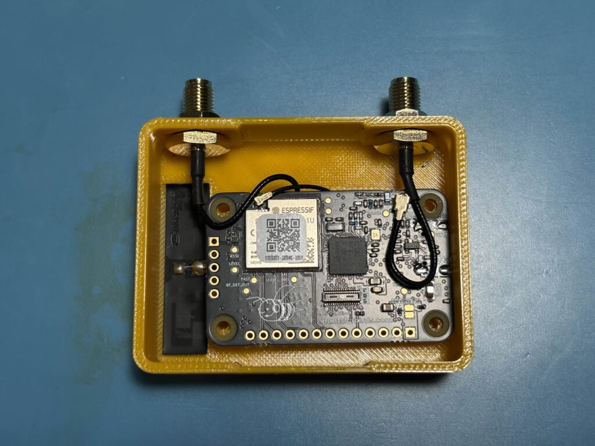
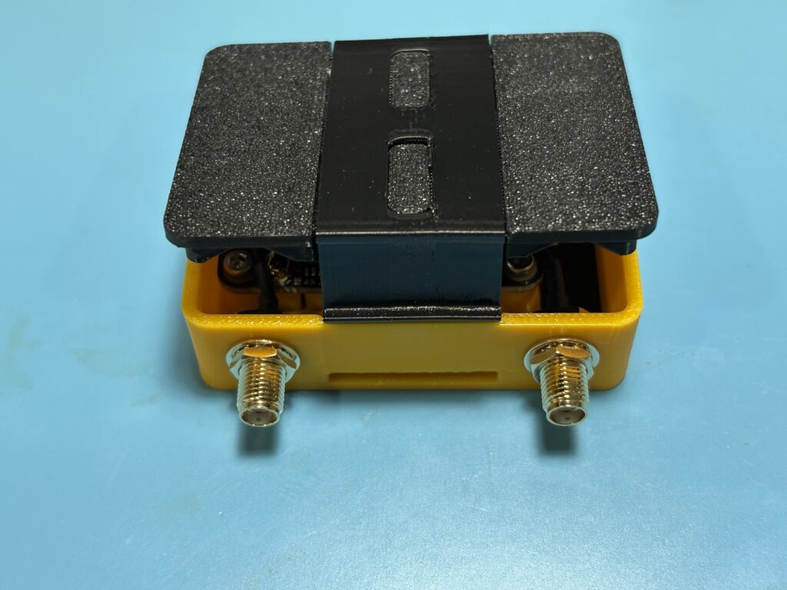
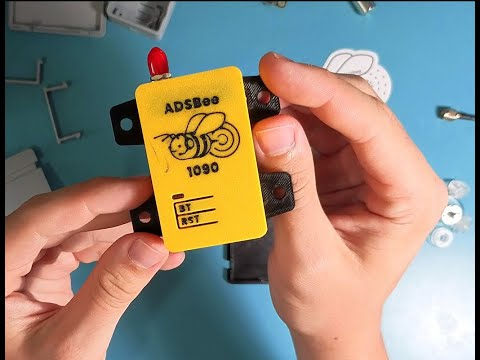

# Modify the ADSBee Enclosure

The ADSBee 1090 ships in a 3D printed PETG enclosure secured with plastic latches. The enclosure can be easily disassembled using a standard USB-C cable to pop the latches out of their holds, allowing the back plate of the enclosure to be swapped out for different designs (e.g. the window feeder mounting bracket).

The ADSBee 1090 can be completely removed from its enclosure by using a 2.0mm hex bit to remove the 4x M2.5 mounting screws that are used to secure the PCBA onto the bosses in the 3D printed case. Use care to not strip the plastic when reinstalling the screws!

!!! warning

    The MHF4 connector on the ESP32 is extremely fragile! Use caution when removing it, as it’s rather easy to rip off of the ESP32. Preferably, use a push / pull tool like [this](https://www.futureelectronics.com/p/interconnect--connector-tools-contacts-accessories/90435-001-i-pex-8144830) to remove the connector safely.

## Install an ADSBee 1090U in its enclosure

Follow the images below to install an ADSBee 1090U into its enclosure. Use caution to avoid blocking LEDs or catching plastic latches with coaxial cables. Coaxial cables should be routed exactly as shown in the images to avoid de-tuning the WiFi antenna or damaging the cables. Note that the bottom cover has cutouts for the SMA connectors on one side only, so can only be installed one way around.

## Enclosure design video

For a detailed overview of the enclosure design, as well as a demonstration of disassembling and assembling the enclosure, please watch the YouTube video below.

## CAD files

3D print files for all of the enclosure components are open source and available for free from the OnShape links below. The enclosure design can be changed and saved by creating a free OnShape account. Note that the “Back Cover” part has multiple configurations, one for a window mount configuration (labeled “Bracket”), and one for the handheld case variant (labeled “Default”).

- [ADSBee 1090 Enclosure CAD](https://cad.onshape.com/documents/1b59debb2d5c6a1c7dcec9f7/w/fdd074a25896943cc37aec26/e/6761c9812310f42db78d8887?renderMode=0&uiState=673eb7afe7165768ee359464)
- [ADSBee 1090U Enclosure CAD](https://cad.onshape.com/documents/923d3695293e091c789d0919/w/4869c770f7c5198611a82dbb/e/b78081524da0e976251e23bb?configuration=List_fcUB7w073gigD7%3DCopy_of_PoE&renderMode=0&uiState=688323ff069b6e60813affc2)

Other 3D files in the repository are listed in the [3d README](https://github.com/PantsForBirds/adsbee/blob/main/3d/README.md).
