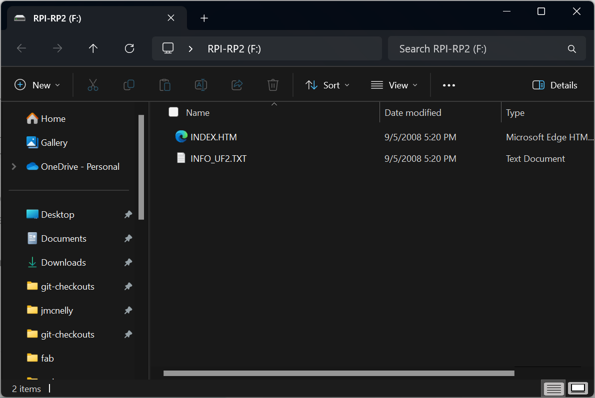
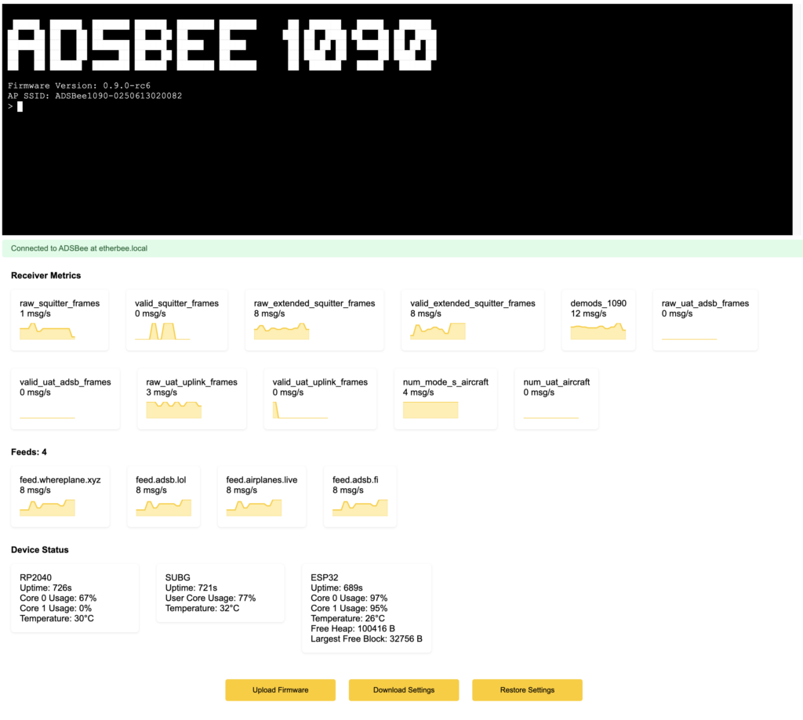

# Update ADSBee Firmware

These steps update the firmware on an ADSBee 1090. Firmware images are published on the [ADSBee Firmware Releases](https://github.com/PantsForBirds/adsbee/releases) page.

## Update via USB

1. Connect your ADSBee to a computer via a USB-C cable. Make sure to use a cable that has data wires, not just power!
2. Press the button labeled “BT” and keep it held down. Press and release the button labeled “RST”. Release the button labeled “BT”. The ADSBee 1090 should show up as a USB mass storage device.

    

3. Go to the [ADSBee Firmware Releases](https://github.com/PantsForBirds/adsbee/releases) page and download the most recent firmware release. All you need is the file ending in “.uf2” (e.g. “adsbee\_1090-0.9.1-rc7.uf2”, or “combined.uf2” in older releases).
4. Drag and drop the .uf2 file into the ADSBee USB mass storage device and wait for it to finish loading. The USB mass storage device should automatically eject when the firmware update is complete.
5. Leave the ADSBee plugged in to your computer while it updates the firmware stored on the ESP32. This should take about a minute; the indicator lights may do some funky things while the firmware is being upgraded. When the orange NETWORK LED begins flashing regularly (at about 5Hz), indicating stable communication between the RP2040 and the ESP32, the firmware update has completed and your device can be unplugged or used as usual.
6. Optional: Check your firmware version by [connecting to the CLI](../getting-started/quick-start.md#connect-to-cli) and sending `AT+DEVICE_INFO?`.

## Update via Network Bootloader

1. Open your device’s webpage (on the ADSBee’s access point or by accessing its IP address / hostname on your network).
2. Scroll down to the bottom of the page and click the “Download Settings” button. This will download all of the ADSBee’s configured settings as a text file of AT commands, called “adsbee\_2026-01-10T09-44-56-324Z.settings” or similar (the timestamp will be set to your local time when you downloaded the file).
3. Click the “Upload Firmware” button and select your firmware file (e.g. “adsbee\_1090-0.9.1-rc7.ota”, or “adsbee\_1090.ota” in older releases).
4. Wait for the device to erase its inactive firmware page and flash the contents of the .ota file. In rare occasions, the update may fail (network issues, etc). The device will not be “bricked”, simply refresh the page and try uploading again.
5. If settings have been wiped (e.g. a major settings version update has occurred), click the “Upload Settings” button to restore your settings using the .settings file you downloaded earlier.

## Building firmware from source

To build the firmware yourself, see the [firmware README](https://github.com/PantsForBirds/adsbee/blob/main/firmware/README.md) on GitHub. ADSBee 1421 firmware updates are covered on the [ADSBee m1421 page](../adsbee-1421/m1421.md#firmware-updates-from-your-host).
