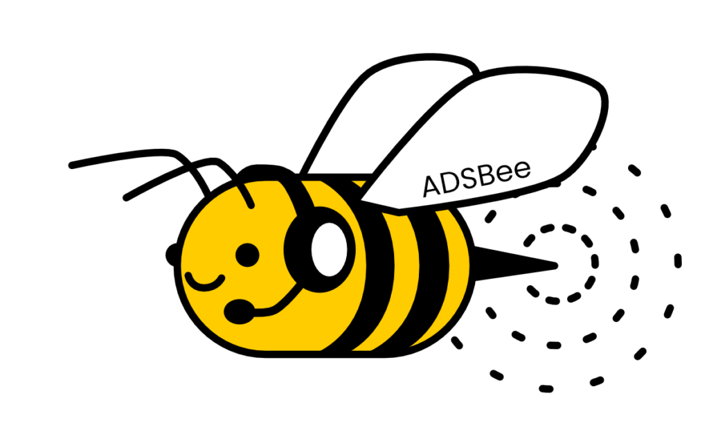

# ADSBee

{ width="480" }

The ADSBee project is on a mission to make open source ADS-B receivers for every embedded application.

ADSBee devices come in a wide range of shapes, sizes, and feature sets, from the ruggedized outdoor GS3M PoE ground station to the world’s smallest and lowest power dual-band ADS-B receiver module, [ADSBee m1421](adsbee-1421/m1421.md).

Currently, ADSBee devices receive 1090MHz Mode S and 978MHz UAT (including TIS-B traffic and FIS-B weather), with more protocols planned for the future.

ADSBee devices exist in two main families: [ADSBee 1090](adsbee-1090/index.md) and [ADSBee 1421](adsbee-1421/index.md).

## Where to start

- New ADSBee 1090 owner? Start with the [Quick Start](getting-started/quick-start.md).
- [Update the firmware](guides/update-firmware.md) or [modify the enclosure](guides/modify-enclosure.md).
- Building something with the ADSBee m1421 module? See the [ADSBee m1421 page](adsbee-1421/m1421.md).
- Source code, schematics, and firmware releases live in the [ADSBee repository on GitHub](https://github.com/PantsForBirds/adsbee) ([releases](https://github.com/PantsForBirds/adsbee/releases)).
- Questions and show-and-tell: [Community](community.md).

## Open Source Hardware + Software

All ADSBee source code files and schematics are available under a GNU GPL v3 license. This means that they can be freely incorporated into other open-source projects that utilize a compatible license. The hope is that by opening the design to contributions and feedback from a community of users, the functionality of the ADSBee 1090 will be enhanced over time. Note that the GPL v3 license applies to re-use of design and source code files, and not finished devices. ADSBee 1090 units purchased from Pants for Birds may be used in commercial applications without any licensing restrictions.

For commercial licensing requests of ADSBee hardware or software design elements, please contact [john@pantsforbirds.com](mailto:john@pantsforbirds.com).

These docs are maintained in the repository; see [Contributing to these docs](contributing.md) to suggest a change.
